# 🦆 Welcome to my Profile here is a duck 🦆 !

### 📅 Currently I'm a... 
<ul>
  <li>student@HTWG-Konstanz 👨‍🎓</li>
  <li>Fullstack-Developer@<a href="https://skillworks.de">Skillworks-AG</a></li>
</ul>

***
## 📊 Stats

<table>
  <tr>
    <td align:"center">
      

      
      

    </td>
    <td rowspan=2>
      

  
      

    </td>
  </tr>
  <tr>
    <td align:"center">
      

        👋 Hello Visitor Nr
      

      

        
      

    </td>
  </tr>
  <tr>
    <td>
      

      
      

    </td>
    <td rowspan="1" align="center">
      
    </td>
  </tr>
  <tr>
    <td colspan="2">
      

      
      

    </td>
  </tr>
</table>
 

  

***

## 🤹🏻 Skills & Tools

  

***

  <picture>
    <source media="(prefers-color-scheme: dark)" srcset="https://raw.githubusercontent.com/Ostabo/Ostabo/output/github-contribution-grid-snake-dark.svg?palette=github-dark" />
    <source media="(prefers-color-scheme: light)" srcset="https://raw.githubusercontent.com/Ostabo/Ostabo/output/github-contribution-grid-snake.svg" />
  
</picture>

 

  

***

## Duck Army assembled! ⚔️🦆🪖
<table>
  <tr>
    <td>
      
    </td>
    <td text-align="justify">
      

        🦆🦆🦆🦆🦆🦆🦆🦆🦆🦆🦆🦆🦆🦆🦆🦆🦆🦆🦆🦆🦆🦆🦆🦆🦆🦆🦆🦆🦆🦆🦆🦆🦆🦆🦆🦆🦆🦆🦆🦆🦆🦆🦆🦆🦆🦆🦆🦆🦆🦆🦆🦆🦆🦆🦆🦆🦆🦆🦆🦆🦆🦆🦆🦆🦆🦆🦆🦆🦆🦆🦆🦆🦆🦆🦆🦆🦆🦆🦆🦆🦆🦆🦆🦆🦆🦆🦆🦆🦆🦆🦆🦆🦆🦆🦆🦆🦆🦆🦆🦆🦆🦆🦆🦆🦆🦆🦆🦆🦆🦆🦆🦆🦆🦆🦆🦆🦆🦆🦆🦆🦆🦆🦆🦆🦆🦆🦆🦆🦆🦆🦆🦆🦆🦆🦆🦆🦆🦆🦆🦆
       

    </td>
    <td>
      
    </td>
  </tr>
